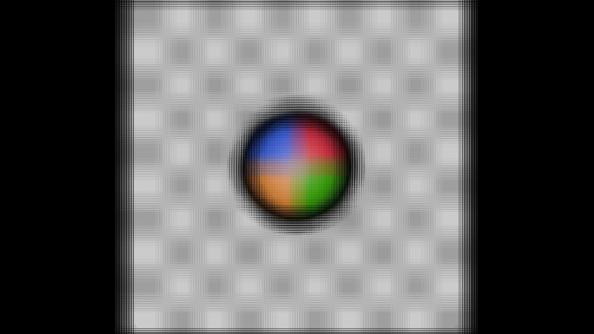
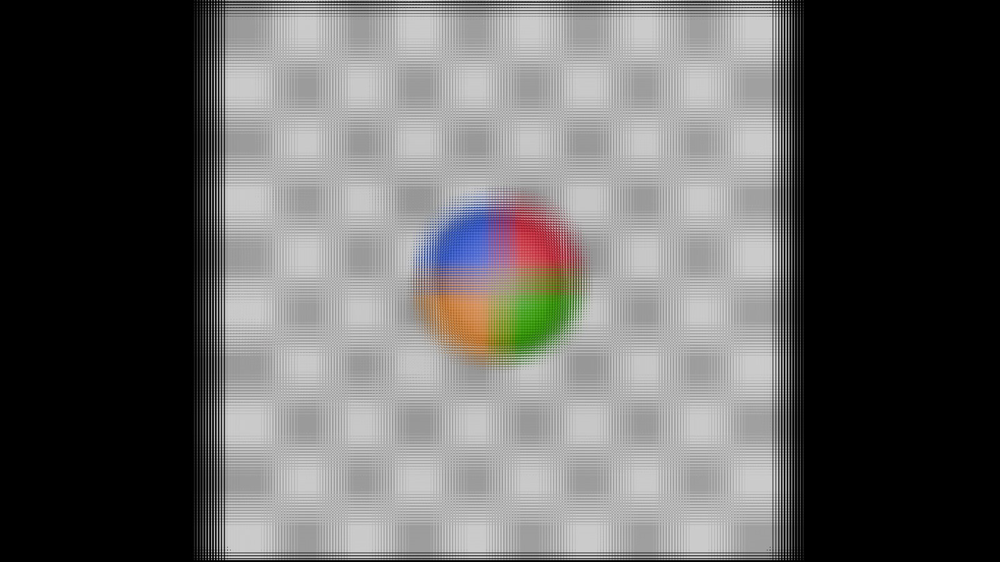
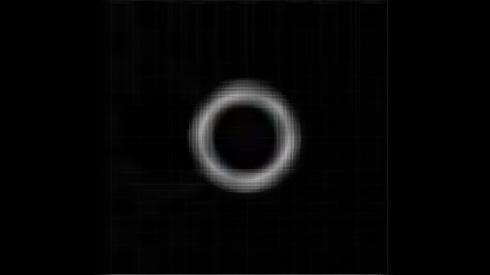
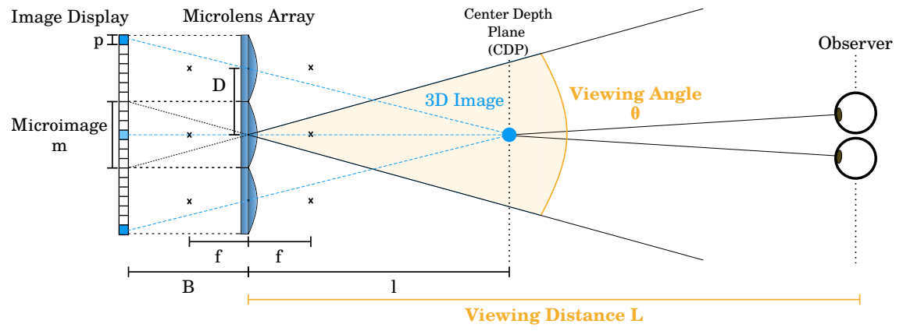
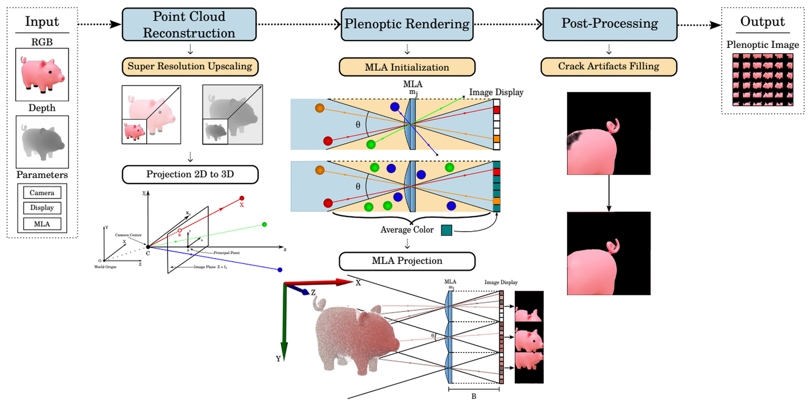
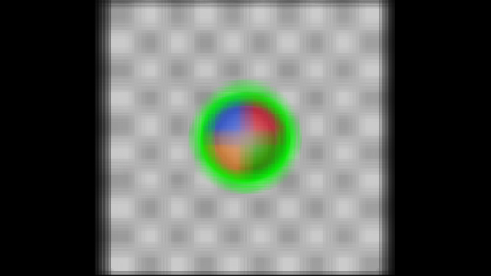


# PIG-GPU: GPU-Accelerated Plenoptic Image Generator with Multi-View Reconstruction

CUDA/C++ redesign of a plenoptic image generation pipeline for **Integral Imaging (glasses-free 3D) displays**, extended to **multi-view RGB+D reconstruction** to recover disoccluded geometry.

> **Credits.** The Plenoptic Image Generator (PIG) was developed by the Computer Vision group at Université Libre de Bruxelles (LISA laboratory). The original repository is hosted on the department's internal GitLab (access restricted).
> This repository contains **my work on top of the original pipeline**, carried out as a *Computing Project* (2025-2026, ULB) under the supervision of Prof. Daniele Bonatto and the PhD Brenno Ribeiro Ferreira.
> Original pipeline: B. Ferreira et al., *"Large-Size Integral Imaging Display with Depth Image-Based Plenoptic Rendering"*, SPIE, 2026.

## Results at a glance

| ~5.8x | ~34 dB | ~350k px |
|:---:|:---:|:---:|
| end-to-end speedup<br>(1713 ms → 293 ms) | PSNR of GPU vs CPU output<br>(post-processing stage) | pixels recovered by multi-view<br>(disocclusion recovery) |

Measured on the `ball` dataset, NVIDIA GTX 1080 Ti (compute capability 6.1).

| Single-view | Multi-view (3 cameras) | Difference |
|:---:|:---:|:---:|
|  |  |  |

Dark halos around the sphere (disocclusions caused by missing geometry in a single view) are significantly reduced when several viewpoints are merged.

## Background

Integral Imaging reconstructs a light field through a **Microlens Array (MLA)** placed in front of a display panel. The panel shows a *plenoptic image*, a grid of microimages, one per microlens, each seen from a slightly different viewpoint. This gives depth perception and motion parallax without glasses.

PIG converts an **RGB + depth** image into such a plenoptic image. The original prototype runs most stages sequentially on the CPU, which causes two problems:

- **Performance:** about 1.7 s per frame on the reference dataset.
- **Artifacts:** a single viewpoint gives a sparse point cloud, producing *cracks* between projected samples and *disocclusions* near object contours.

<p align="center"></p>
<p align="center"><sub>Integral Imaging geometry (adapted from Ferreira et al., 2026).</sub></p>

## My contributions

### 1. GPU redesign of the pipeline (CUDA)
The two most expensive stages were moved to the GPU, preserving the original behaviour:

- **Point cloud generation:** validity-mask kernel, stream compaction with `cub::DeviceScan::InclusiveSum`, and a projection/scatter kernel (pinhole back-projection, one thread per pixel).
- **Post-processing:** crack-filtering kernel with ROI-based execution, plus a rotation kernel.
- **Profiling** with NVIDIA Nsight to identify bottlenecks and check that the kernels use the hardware well.
- The original CPU pipeline is **kept** and can be selected with a configuration flag, so both versions can be benchmarked on the same input.

### 2. Multi-view reconstruction (CUDA)
The pipeline now accepts datasets with **multiple RGB+D cameras**:

1. One point cloud per camera (reusing the GPU back-projection).
2. **Registration and merging** into a common reference frame with a rigid transform, `p_world = R^-1 · p_camera + C`, using one CUDA thread per point.
3. Plenoptic rendering and post-processing on the merged cloud.

## Pipeline

<p align="center"></p>
<p align="center"><sub>Original PIG pipeline (adapted from Ferreira et al., 2026).</sub></p>

## Evaluation

All experiments ran on the `ball` dataset. The original CPU output is the reference for both correctness and timing.

### Performance

| Stage | CPU (ms) | GPU (ms) |
|---|---:|---:|
| Pre-processing | 65.2 | 26.8 |
| Point cloud generation | 255.8 | 128.1 |
| Plenoptic rendering | 548.3 | 36.5 |
| Post-processing | 844.0 | 101.7 |
| **Total** | **1713.4** | **293.0** |

<!-- TODO: add a short note explaining what the CPU baseline is for the rendering and pre-processing rows (the report says rendering was already GPU-based and pre-processing was kept on CPU in the original prototype). -->

### Correctness

| Stage compared against CPU output | PSNR |
|---|---:|
| Post-processing | ~33.9 dB |
| Point cloud generation (post-processing disabled on both) | ~31 dB |

The residual difference most likely comes from the ordering of projected points, which is sequential on the CPU and unordered on the GPU. Using float vs double precision and stream compaction did not remove it.

### Kernel profiling (Nsight)

| Kernel | Occupancy | Observation |
|---|---:|---|
| Projection / scatter | 82.3% | memory-bound, memory dependency dominates stalls |
| Crack filtering | 88.6% | L2 cache utilization 97%, close to memory-bandwidth saturation |
| Multi-view registration | 86.7% | low arithmetic cost, memory dependency dominates stalls |

### Multi-view results

Execution time of the multi-view pipeline (3 cameras):

| Stage | Time (ms) |
|---|---:|
| Multi-view point cloud generation (GPU) | 605.8 |
| Multi-view registration (GPU) | 46.4 |
| Plenoptic rendering | 61.0 |
| Post-processing (GPU) | 112.1 |
| **Total** | **825.3** |

The extra runtime comes from processing several cameras; the goal of this stage was geometric completeness rather than speed.

Quality metrics:

| Metric | Value |
|---|---:|
| Recovered pixels | 350,023 |
| Recovery ratio (recovered / invalid in single view) | 5.16% |
| Valid pixel density, single-view | 53.98% |
| Valid pixel density, multi-view | 56.23% |

| Recovered pixels | Overlay on the multi-view result |
|:---:|:---:|
|  |  |

## Limitations and future work

- Evaluation uses a **single dataset** (`ball`), where most invalid pixels belong to the background, so the recovery ratio is modest. More complex scenes and higher resolutions are needed to generalize the results.
- The GPU point cloud stage does not reproduce the CPU output exactly (see PSNR above).
- The **duplicate-point filtering** kernel in multi-view registration is prepared (GPU validity mask) but not yet enabled in the final pipeline.
- Both new stages are memory-bound: memory-access optimization is the main direction for further speedups.

## Documentation

- [Project report](docs/GPU_Redesign_of_PIG_report.pdf): *PIG: GPU Redesign of a Plenoptic Imaging Pipeline and Extension to Multi-View Reconstruction* (23 pages).
- [Presentation slides](docs/GPU_Redesign_of_PIG_slides.pdf) (12 slides).

## Build and run

<!-- TODO: paste here the build guide from the original repository, then fix:
  - remove the personal path (C:\Users\Frbre\...) and use a generic one
  - use one executable name consistently (pig.exe vs pig_cpp.exe)
  - document the flag that switches between CPU and GPU pipelines
  - state requirements: CUDA toolkit version, GPU used (GTX 1080 Ti, compute capability 6.1)
-->

*The instructions below are adapted from the original PIG repository.*

(original guide)

## License and acknowledgements

Original PIG code and the figures marked "adapted from" belong to their authors (see Credits). Thanks to Prof. Daniele Bonatto and Brenno Ribeiro Ferreira for their supervision and guidance.

## Installation

### Prerequisites

- Visual Studio + CMake
- CUDA 13.1
- OpenCV 4.12.0
- Eigen 3.4.1
- nlohmann::json (automatically installed)

### Project Structure

Create a top-level project folder containing `lib/` and `code/` folders:

```ascii
project/
├── lib/
│   ├── opencv/
│   └── eigen/
└── code/
    ├── config/
    └── datasets/
    └── ...
```

- `lib/` contains all the libraries required by the software (currently OpenCV and Eigen).  
- `code/` contains all the source code.

---

#### Visual Studio Installation

> Visual Studio is an IDE made by Microsoft with its own Windows C++ compiler.

It is the easiest way to code for Windows. You can use other editors like VS Code, but you will lose the quick compilation and building features.

1. Download the installer from [Visual Studio](https://visualstudio.microsoft.com/fr/downloads/).  
2. Run the installer and follow the steps until the workload selection screen.  
3. Select the following workloads:
   - **Desktop Development with C++**
   - **CMake**
   
   > This installs the compiler, Windows SDK, and all tools needed.  
4. Complete the installation and launch Visual Studio.  
5. Select **Open Project Folder** and choose the `code/` folder.

---

#### CUDA Installation

> CUDA is a programming framework for NVIDIA GPUs.

Check if CUDA is already installed:

```bash
nvcc --version

C:\Users\user_name>nvcc --version
	nvcc: NVIDIA (R) Cuda compiler driver
	Copyright (c) 2005-2025 NVIDIA Corporation
	Built on Tue_Dec_16_19:27:18_Pacific_Standard_Time_2025
	Cuda compilation tools, release 13.1, V13.1.115
	Build cuda_13.1.r13.1/compiler.37061995_0
```

The output shows that the version installed is: "Cuda compilation tools, release 13.1, V13.1.115" -> 13.1.

If the version is not correct, download and install CUDA 13.1 from [NVIDIA CUDA Toolkit 13.1](https://developer.nvidia.com/cuda-13-1-0-download-archive).

---

#### OpenCV Installation

> **OpenCV** is a library for image processing used to load, manipulate and save images.

1. Download the ***OpenCV 4.12.0*** from the [OpenCV Releases](https://opencv.org/releases/) page.
2. Extract the files into `lib/opencv-4.12.0`.
3. Set the following environment variable:
	- `OpenCV_DIR = C:\path-to-project\lib\opencv-4.12.0\build\x64\vc16\lib`
	- `OPENCV_IO_ENABLE_OPENEXR = 1`
		- This is required to enable OpenEXR support in OpenCV.
4. Add the OpenCV `bin` directory to your system `PATH`:
	- `C:\path-to-project\lib\opencv-4.12.0\build\x64\vc16\bin`

---
	
#### Eigen Installation

> **Eigen** is a mathematical library used for fast linear algebra and other mathematical operations.

1. Download ***Eigen 3.4.1*** from [Eigen GitLab](https://gitlab.com/libeigen/eigen/-/releases/3.4.1).
2. Extract files into `lib/eigen-3.4.1`.
3. You need to build and install the library. Open a `cmd` and run the commands:
```bash
cd C:\Eigen
mkdir build
cd .\build
cmake ..
cmake --build . --target install
```

After this, CMake should automatically detect your Eigen installation.

## Running PIG

Once all libraries are installed, Visual Studio will be able to build and compile PIG.

To run PIG, you need to provide some arguments:
```bash
C:\path-to-project\code\out\build\x64-release\pig.exe --system_spec <path-to-system-spec>.json --dataset <path-to-dataset>.json --config <path-to-config>.json --output <path-to-output>.png
```

To automate this, you can set up these arguments in Visual Studio so that you can click **Run**(Hollow green button). Follow these steps:
1. Open Visual Studio in the project folder.
2. Go to **Run and Debug → Edit Configuration**. This will open the file `launch.vs.json`.
3. Add the following configuration:
```json
{
  "version": "0.2.1",
  "defaults": {},
  "configurations": [
    {
      "type": "default",
      "project": "CMakeLists.txt",
      "projectTarget": "pig_cpp.exe",
      "name": "Run PIG",
      "args": [
        "--system_spec",
        "specifications/prototype_spec.json",
        "--dataset",
        "datasets/ball.json",
        "--config",
        "config/pig_default.json",
        "--output",
        "C:\\Users\\Frbre\\Documents\\GitHub\\pig_cpp\\results\\plenoptic.png"
      ]
    }
}
```

Whenever you want to change any of these runtime parameters, open this file and update the values accordingly.
